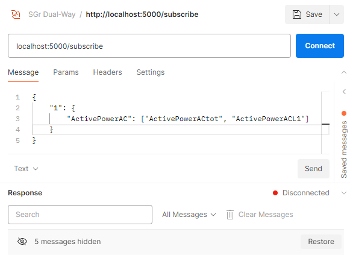

# SGr-Intermediary

## Running the intermediary

### Docker

Note: You may need to install requirements first, as defined in _Local_.

```bash
docker compose up -d
``` 

### Local

1. Clone or check out this repository.

2. Create and activate virtual environment:

```bash
python -m venv .venv

# Windows PowerShell
.\.venv\Scripts\Activate.ps1

# Linux
source .venv/bin/activate
```

3. Install the requirements:

```bash
pip install -r requirements.txt
```

4. Run the intermediary:

```bash
python main.py
```

> [!NOTE]
> The intermediary will be running on port 5000 either way.

## Running the tests with Postman

1. Import the postman collection from the `Postman` folder.
   2.1 Initialize 2 instances.
   2.2 Now you can read/delete instances and their data.
   2.3 Websockets can't be exported from postman, but here's a screenshot.

## API Documentation

The API documentation can be found at `http://localhost:5000/docs` after running the intermediary.
