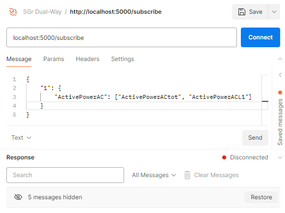

# SGr-Intermediary

## Getting Started

First change directory to sgr

```
cd sgr
```

Download the submodule (after cloning the repo):

``` 
git submodule init
git submodule update
```

or clone the repo manually:

```
git clone https://github.com/SmartGridready/SGrPython .
```

## Running the intermediary

### Docker:

``` 
sudo docker compose up --build
``` 

### Local:

1. Install the requirements:

```
pip install -r sgr/requirements.txt
```

```angular2html
pip install -r requirements.txt
```

```bash
pip install -e sgr
```

2. Run the intermediary:

```
python3 -u main.py
```

> [!NOTE]
> The intermediary will be running on port 5000 either way.

## Running the tests with postman

1. Import the postman collection from the `Postman` folder.  
   2.1 Initialize 2 instances  
   2.2 Now you can read/delete instances and their data  
   2.3 Websockets can't be exported from postman, but here's a screenshot

## API Documentation

The API documentation can be found at `http://localhost:5000/docs` after running the intermediary.

## Disclaimer - Community Support

This project is developed and maintained by the _SmartGridready_ community.
Contributions to the code are encouraged and welcome.
If you would like to contribute bugfixes or features, contact the maintainers.
Please be aware that _SmartGridready_ does not provide commercial support,
and the software is provided "as is" without warranty of any kind.
